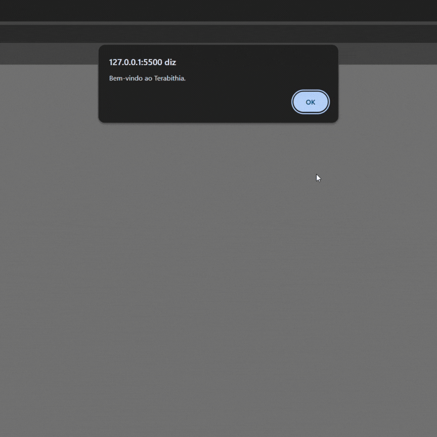

# Hotel Terabithia: Plataforma Interna de Operações Hoteleiras

## Descrição do Projeto

Projeto desenvolvido para aprender lógica de programação com a linguagem JavaScript.

O objetivo é criar uma plataforma interna de gestão para uso de colaboradores do hotel (não voltada a hóspedes), aplicando arquitetura modular com subprogramas independentes.

## Descrição do Projeto

Ao iniciar a execução do programa, o sistema chama a função `autenticacao()`, responsável por validar o acesso do usuário. Após a autenticação bem-sucedida, o usuário é direcionado ao menu principal do sistema, implementado pela função `inicio()`.

No menu principal, o usuário pode selecionar uma das seguintes opções, que acionam um subprograma diferente:

1. **Reserva de Quartos** – Realiza reservas em quartos disponíveis;
2. **Cadastro de Hóspedes** – Acessa o menu com o CRUD de hóspedes;
3. **Eventos** – Realiza reservas de auditório para eventos, e calcula o custo;
4. **Ar-Condicionado** – Calcula orçamentos de manutenção de ar-condicionado;
5. **Abastecimento de Carros** – Analisa preços de combustíveis e indica a melhor opção;
6. **Relatórios Operacionais** – Exibe dados registrados no sistema, como o total de reservas e a receita acumulada;
7. **Sair** – Encerra o programa.

Após a execução de um subprograma, o sistema retorna ao menu principal até que o usuário escolha a opção de saída.

## Evidência de Teste
  

## Arquitetura Modular

O sistema foi desenvolvido seguindo uma abordagem modular, com o objetivo de separar as principais funcionalidades do hotel. Essas funcionalidades estão organizadas nos seguintes módulos:

- **Módulo Principal** (`inicio()`)  
    Exibe o menu principal e direciona o usuário para os demais módulos conforme a opção escolhida.

- **Reserva de Quartos** (`reservar_quarto()`)  
    Responsável pela escolha do quarto, cálculo do valor da estadia e a confirmação da reserva.

- **Cadastro de Hóspedes** (`menu_cadastro_hospede()`)  
    Permite cadastrar, consultar, listar, alterar e excluir hóspedes.

- **Eventos** (`reservar_evento()`)  
    Realiza a reserva do auditório para eventos e o cálculo dos custos.

- **Ar-Condicionado** (`orcamento_ar_condicionado()`)  
    Calcula orçamentos de manutenção de ar-condicionado e indica o menor valor.

- **Abastecimento de Carros** (`abastecimento()`)  
    Analisa preços de combustíveis e indica a melhor opção;

- **Relatórios Operacionais** (`relatorio_operacional()`)  
    Exibe dados registrados no sistema, como o total de reservas e a receita acumulada.

Os dados do sistema são mantidos apenas em estruturas em memória, sem uso de banco de dados.

## Enunciado da atividade
[Acessar enunciado da atividade](https://github.com/gabaugusto/hora-de-codar-hotel-terabithia)
